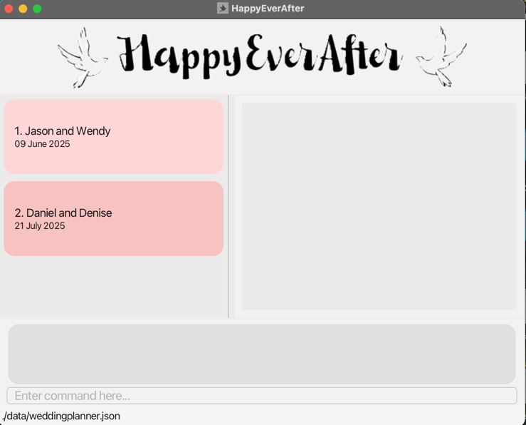
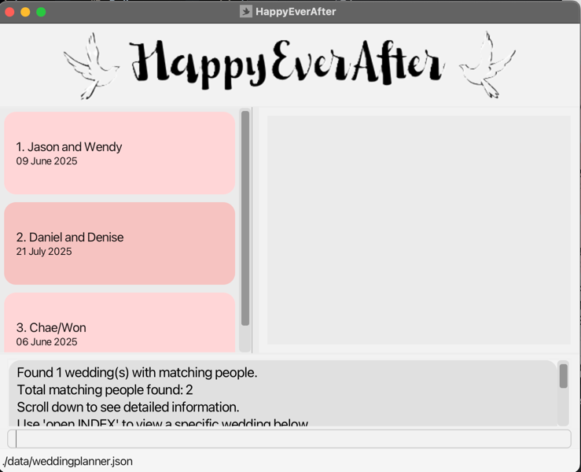

# HappyEverAfter User Guide

Welcome to HappyEverAfter - a quick, robust, and intuitive Wedding Planner designed to help wedding organisers keep track of their weddings. 
HappyEverAfter provides a plethora of features, including creating weddings and adding different people with different roles to each wedding. 
Wedding planning can get hectic, especially for a busy planner like you, and with just some simple commands, HappyEverAfter can help you get organised and sorted in no time!

<!-- * Table of Contents -->
## Table of Contents

1. [Quick Start](#quick-start)
2. [Feature Preface](#feature-preface)
3. [GUI Overview](#gui-overview)
4. [Features](#features)
    - [Wedding Management](#wedding-management)
        - [Creating a new wedding](#creating-a-wedding-new)
        - [Opening a wedding](#opening-a-wedding-open)
        - [Closing a wedding](#closing-the-current-wedding-close)
        - [Listing all weddings](#listing-all-weddings-list)
        - [Sorting weddings by date](#sorting-weddings-by-date-sort)
        - [Deleting a wedding](#deleting-a-wedding-delete)
        - [Deleting all weddings](#clearing-all-weddings-clear)
    - [Member Management](#member-management)
        - [Adding a person to a wedding](#adding-a-person-to-a-wedding-add)
        - [Finding people of weddings](#finding-people-find)
        - [Filtering for people by tags](#filtering-by-tag-filter)
        - [Removing a person](#removing-a-person-remove)
        - [Editing a person](#editing-a-person-edit)
    - [System Commands](#system-commands)
        - [Viewing help](#viewing-help--help)
        - [Exiting the program](#exiting-the-program-exit)
5. [Data Storage](#data-storage)
6. [FAQ](#faq)
7. [Command Summary](#command-summary)

--------------------------------------------------------------------------------------------------------------------

## Quick start

1. Ensure you have Java `17` or above installed in your Computer. To check your Java version, open a terminal or command prompt and type `java -version`  If Java is not installed or is an older version:
   - **Windows / Linux users:** Follow the instructions to download and install the latest JDK here : [Java Installation](https://www.java.com/en/download/help/download_options.html)
   - **Mac users:** Ensure you have the precise JDK version prescribed [here](https://se-education.org/guides/tutorials/javaInstallationMac.html).
2. Download the latest version of HappyEverAfter
   - Click the following link [here](https://github.com/AY2425S2-CS2103T-W09-4/tp/releases) and download the file `happyeverafter.jar`. Ensure that you download from the latest release.
3. Move the file to a folder
    - Copy the file to the folder you want to use as the _home folder_ for your HappyEverAfter. The program will store program data and save data in this folder.
    - Tip : Choose a convenient folder location, such as a folder on your home screen. Ensure that you have read and write permissions to the folder.
4. Running HappyEverAfter
   - Open the "Command Prompt" (for Windows, press `Win + R`, type `cmd` and hit Enter) or "Terminal" (for Mac/Linux, search for the Terminal app).
   - Enter `cd` followed by the folder location where you saved the HappyEverAfter file. For example:
     - On Windows: `cd C:\Users\JohnDoe\Desktop\HappyEverAfter`
     - On Mac/Linux: `cd /Users/JohnDoe/Desktop/HappyEverAfter`
   - Run this command to launch HappyEverAfter: `java -jar happyeverafter.jar`
   - A Graphical User Interface (GUI) similar to the image below should appear in a few seconds. Note how the app contains some sample data. You can choose to clear the data for a clean setup.

      

5. Type the command in the command box where it says `Enter command here...` and press Enter to execute the command.
   - See [features](#features) for a comprehensive list of all commands and [command summary](#command-summary) for a brief overview.
   - Some example commands you can try:
     - `list` : Lists all weddings
     - `clear` : Clears all weddings
     - `exit` : Exits HappyEverAfter
     - `new n/John and Janice's Wedding d/21082025` : Creates a new wedding named `John and Janice's Wedding` on `21 Aug 2025`. Enter the subsequent commands when prompted.
       - `add n/Janice p/98765432 e/janice@gmail.com a/Block 09 Prince George's Park t/bride` : Add `Janice` as a `bride`
       - `add n/John p/98989898 e/john@gmail.com a/Block 10 Prince George's Park t/groom` : Add `John` as a `groom`
     - `sort` : Sorts weddings in ascending order of the date

[Back to Table of Contents](#table-of-contents)

--------------------------------------------------------------------------------------------------------------------

## Feature-Preface

<box type="info">
### Some things you need to know about the features before getting started:

- Commands are case-insensitive.
  - e.g. `Help` and `help` will run the same command.
  - However, parameters are not case-sensitive, unless stated otherwise.
  
- Words in `UPPER_CASE` are the parameters to be supplied by you, the user.
  - e.g. in `new n/WEDDING_NAME`, you should replace `WEDDING_NAME` with the actual name, like `new n/John & Mary`

- For commands requiring an `INDEX` (such as `open` or `delete`), all inputs must be a valid positive integer passed to the `INDEX` field.
  - If an invalid `INDEX` is passed (such as if the `INDEX` is larger than the number of weddings), an error message will be displayed.

- Items in square brackets are optional.
  - e.g `n/NAME [t/TAG]` can be used as `n/John Doe t/friend` or simply as `n/John Doe`.

- Items with `…`​ after them can be used multiple times including zero times.
  - e.g. `[t/TAG]…​` can be used as ` ` (i.e. 0 times), `t/friend`, `t/friend t/family` etc.

- Parameters can be provided in any order.
  - e.g. if the command specifies `n/NAME p/PHONE_NUMBER`, `p/PHONE_NUMBER n/NAME` is also acceptable.

- Extraneous parameters for commands that do not take in parameters (such as `help`, `list`, `exit` and `clear`) will be ignored.
  - e.g. if the command specifies `help 123`, it will be interpreted as `help`.

 - Special role tags to identify the bride and groom:
    - Use `t/bride` to designate a person as the bride
    - Use `t/groom` to designate a person as the groom
    - A wedding must have both a bride and groom to be valid
</box>

  
[Back to Table of Contents](#table-of-contents)

## GUI Overview
HappyEverAfter uses a Graphical User Interface (GUI) to display visual information to the user. Here is a brief overview of the GUI.

On the left pane of the GUI, all weddings are listed. If you have more weddings than the height of the left pane, you can use the mousewheel
to scroll down the weddings. Each wedding is displayed with the `name` of the wedding (eg `Jason and Wendy`) and the `date` of the wedding (eg `09 June 2025`). The
`index` of the wedding is displayed on the left of the `name`, from 1 onward. You can use this `index` for commands such as `open` and `delete`.

At the bottom of the GUI is the section for you to enter commands. Type in your command in the pane where it says
`Enter command here...` and press Enter to run the command. The result of the command will be displayed in the grey pane
above the input box.

When a wedding is opened using the `open` command (eg `open 1`), it is set as an active wedding and displayed
on the right pane of the GUI. The pane displays all members of the wedding, starting with the `bride` and `groom`. 
If the number of members exceeds the height of the pane, you can scroll within the pane using your mousewheel. Each member card
displays the following information in order : The `name` of the person, the `tags` of the person, the `phone number` of the person,
the `address` of the person and the `email` of the person.

## Features

## Wedding Management

### Listing all weddings: `list`

You can view a list of all weddings in the wedding planner.

Format: `list`

### Creating a wedding: `new`

You can create and add a new wedding to the wedding planner.

Format: `new n/WEDDING_NAME d/DATE`

Example:
- `new n/John & Mary d/25122025` : Adds a wedding named `John & Mary` that happens on `25 December 2025`.

<box type="info">
Note:

- HappyEverAfter will prompt you immediately to enter the details of the bride and the groom to confirm
  the wedding. Follow the instructions given in the prompt to complete the creation of the wedding.
  - Each wedding must have exactly one bride and one groom.
  - Use `t/bride` to designate a person as the bride.
  - Use `t/groom` to designate a person as the groom.
- See [Adding a person to a wedding](#adding-a-person-to-a-wedding-add) for more details.
- You cannot add a wedding with the exact same `WEDDING_NAME` and `DATE` as one that already exists.
</box>

<box type="info">

**You will not be able to issue other commands while in the process of creating a wedding** 
To cancel creating the wedding, type `n`. To exit the app, type `exit`.

</box>

<box type="info">

++**Restrictions on Parameters**++

**Names:**

- Should not be blank.
- Should be case-sensitive.
- Can contain any amount of alphanumeric characters, spaces, and special characters.
- Does not have to match the name of the bride and groom. You can name your wedding to what you see fit.

**Dates:**

- The `DATE` Parameter has to be in the format `DDMMYYYY`.
  - e.g `25122025` for the 25th December 2025
- Can be any date, past, present or future. We allow past dates for cases such as keeping records on past wedding events.

</box>

### Opening a wedding: `open`

You can open a wedding from the Wedding Planner to view its people and edit its people.

Format: `open INDEX`

Examples:

- `open 1` (Opens the first wedding in the list)
- `open 3` (Opens the third wedding in the list)

After a wedding is open, the members belonging to that wedding will be displayed on the right pane as shown below. You can then
proceed to perform further operations like adding members or editing members.:

<box type="tip">

**Tip:** You can open a new wedding without closing the current one. HappyEverAfter will automatically close the current wedding and open the new one.

</box>

### Closing the current wedding: `close`

You can close the currently open wedding project to return to the main view.

Format: `close`

### Sorting weddings by date: `sort`

You can view the displayed weddings by chronological order - with the earliest wedding at the top.

Format: `sort`

### Deleting a wedding: `delete`

You can delete a wedding from the wedding planner based on the provided index.

Format: `delete INDEX`

Examples:

- `delete 1` (Deletes the first wedding in the list)
- `delete 3` (Deletes the third wedding in the list)

<box type="info">
Note:

- You can delete any wedding (even the open one) regardless if there is a wedding open or not.
- If an open wedding is deleted, you will still be able to run commands on the open wedding. However, no data will be saved.

</box>

### Clearing all weddings: `clear`

Deletes All weddings and associated contacts from the wedding planner. 

Format:
- `clear` followed by `y` will delete all weddings from the wedding planner.
- `clear` followed by `n` will abort the delete operation, and it will not clear the weddings.

<box type="info">
Note:

- To prevent accidental deletions, there will be a secondary confirmation prompt issued after `clear` to
  confirm the deletion.

</box>

<box type="tip">

**Tip:** You can use `clear` to set up a fresh wedding planner if you don't want the sample data.

</box>

[Back to Table of Contents](#table-of-contents)

## People Management

### Adding a person to a wedding: `add`

You can add a person to the [opened](#opening-a-wedding-open) Wedding Planner.
You can use tags to specify if the person is a bride, groom, or other wedding party participant.
The new person will be displayed on the right pane of the GUI.

Format: `add n/NAME p/PHONE_NUMBER e/EMAIL a/ADDRESS [t/TAG]…​`

Examples:

- `add n/Mary Muller p/98765432 e/mary@example.com a/123 Kentridgr St t/bride`
- `add n/John Danny p/89989788 e/john@example.com a/456 UTR Ave t/groom`
- `add n/Harry Kane p/13701978 e/kane@example.com a/789 NUS Rd t/bridesmaid`
- `add n/Alan Wayne p/98775633 e/alan@example.com a/123 Clementi Rd t/photographer`

<box type="info">

++**Restrictions on Parameters**++

**Names:**
- Should not be blank.
- Can be any length.
- Can only contain alphanumeric characters, spaces and limited special characters(`,` or `'` or `.` or `-`)
- Can not start with the special character.
- Should not be identical to any person already in the wedding.
  - e.g. If a person with the name of "Ma Dong-Seok" already exists in the wedding,
    - A person by the name of "ma Dong-Seok" can be added.
    - A person by the name of "Ma  Dong-Seok" (with two spaces between "Ma" and "Dong-Seok") can be added.
    - A person by the name of "Ma Dong-Seok" cannot be added.

**Phone numbers:**
- Should not be blank.
- Should only contain numbers (no letters, spaces or special characters).
- Can be any length.

**Email addresses:**
- Should be of the format `LOCAL_PART@DOMAIN`, with the following constraints:
- `LOCAL_PART` has the following constraints:
  - Should only consist of alphanumeric characters and these special characters: `+_.-`.
  - Should not be blank.
  - Should not start or end with any of the above special characters.
- `DOMAIN` is a domain name, which is made up of 1 or more domain labels separated by periods.
- Each domain label has the following constraints:
  - Be at least 2 characters long.
  - Should start and end with alphanumeric characters.
  - Should consist only of alphanumeric characters, separated only by hyphens, if any.
- Examples of valid emails:
  - `admin@localhost`
  - `e1234567@u.nus.edu`
  - `chae-won@gmail.com`
  - `fong_hrishi@out-look.com`

**Addresses:**

- Should not be blank.
- Can take any value.

**Tags:**
- Should consist only alphanumeric characters, with no spaces
- Should be case-sensitive: A tag "Brother" is considered different from "brother".
  - The only exception to this are the `groom` and `bride` tags. These tags are case-insensitive.
  - Different casing variations of them (e.g., "GROOM, "Groom", "gRoOm") will not be permitted if the wedding already has a person with that corresponding tag.
- Only one person in each wedding may have the `groom` and `bride` tag, specified with `t/groom` and `t/bride` respectively.
  - However, a bride and groom may have other tags.
- Can have any number of tags (including 0)

</box>

### Finding people: `find`

You can search for all weddings that contain the names of people that match any one of the provided search terms.

Format: `find [NAME]…​`

Examples:

- `find Sun`
- `find Sun Hrishi`
- `find sun timo`

<box type="info">

++**Note:**++

- Search term should not be blank or consist only of spaces. For examples, `find    ` will be counted as an invalid command.
- Search terms are case-insensitive. Typing `find sun` will produce a match for a person named `SUN`
- You can provide any number of search terms, separated by spaces.
  - `find` will match names to at least one of the search terms. For instance, `find sun timo` will return results for both the person named `sun` and the person named `timo`.
  - The ordering of the terms does not matter. For example, `find Zhe Hao` will return the same result as `find Hao Zhe`.
- Names do not have to be an exact match for the search term. For example, `find timo` will result a result for a person named `timothy`
  - However, the search term must be *continuous*. For example, if the person is named `timo`, `find tim` will return a result but `find tio` will not return a result.

</box>

The result of the search will be outputted on the result box above the command input box. You can then use the `open` command to
open a wedding based on the result. A sample output is shown below:

### Filtering by tag: `filter`

You can filter the list of the currently [opened](#opening-a-wedding--open) wedding to display all people that match at least one of the tags.

Format: `filter [TAG]…​`

Examples:

- `filter bride` : Displays only the bride
- `filter groom` : Displays only the groom
- `filter` : Displays all people without filtering
- `filter photographer caterer guest` : Displays all people that has at least one of the tags. For example, if Person 1 has the `photographer` tag and Person 2 has the `guest` tag, both Person 1 and Person 2 will be displayed in the filtered result.

<box type="info">

++**Note:**++

- Tags are case-sensitive.
- Tags can only be alphanumeric characters.
- Tag matching is done on an individual basis.
  - For example, `filter photographer guest` will match all people that have either `photographer` or `guest` tag or both tags. The person does not need to have the exact same tags as all the tags specified in the filter command.
  - Similarly, `filter photographer` will match a person that has both the tags `photographer` and `guest`. The filter command does not have to contain all tags for the person; it only has to match at least one.
- Tag matching is done on a complete string comparison basis.
  - For example, `filter pho` will not match a person with the tag `photographer`. The individual tag string must be an exact match.

</box>

<box type="tip">

**Tip:** If you want to clear the filters, use the filter command with no tags, i.e. `filter`

</box>

### Removing a person: `remove`

You can remove a person from the currently [opened](#opening-a-wedding-open) wedding based on the provided index.
The index refers to the index number shown in the displayed list. The index **must be a positive integer**.
The active wedding pane will be automatically updated with the new list of members

Format: `remove INDEX`

Example:

- `remove 3` (Removes the third person in the list)

In the example usage below, issuing `remove 3` will remove the person named `timo` from the active wedding.

After removing: 

<box type="info">

++**Note:**++

- You cannot remove a bride or groom from a wedding. Every wedding must have both roles.

</box>

### Editing a person: `edit`

You can edit the details of a person in the currently [opened](#opening-a-wedding-open) wedding.

Format: `edit INDEX [n/NAME] [p/PHONE] [e/EMAIL] [a/ADDRESS] [t/TAG]...`

Examples:

- `edit 1 p/91234567 e/newemail@example.com` will update the `phone` and `email` of the person at index `1` to be `91234567` and `newemail@example.com` respectively.
- `edit 2 n/New Name a/New Address` will update the `name` and `address` of the person at index `2` to be `New Name` and `New Address` respectively.

<box type="info">

++**Note:**++

 - You cannot edit the `bride/groom` tags of a person.
 - At least one field must be provided for editing.
 - When editing tags, the *existing* tags of the person will be removed.
  - e.g. if the person already has the tag `Brother`, and you want to add a new tag `Coming`, you will have to run the command `edit INDEX t/Brother t/Coming`.
  - If you want to remove all tags from a person, you can enter `t/` with no tags behind. This will remove all tags from the person at the specified index.

**Restrictions on Parameters:**

- See **Restrictions on Parameters** in the [add command](#adding-a-person-to-a-wedding-add) for more details.
</box>

<box type="tip">

**Tip:** If you need to change the bride or groom of a wedding, use `edit` to change their information instead of editing the tag of another person to make them bride/groom.

</box>

[Back to Table of Contents](#table-of-contents)

## System commands

### Viewing help : `help`

You can view a message providing a web link to access the User Guide.

Format: `help`

### Exiting the program: `exit`

You can exit the HappyEverAfter application.

Format: `exit`

[Back to Table of Contents](#table-of-contents)

## Data Storage

### Saving the data

HappyEverAfter data is saved in the hard disk automatically after any command that changes the data. There
is no need to save manually.

### Editing the data file

HappyEverAfter data is saved locally as a JSON file in `[JAR file location]/data/weddingplanner.json`.
Advanced users are welcome to update the data directly by editing that data file.

<box type="warning">

**Caution:**
If your changes to the data file makes its format invalid, HappyEverAfter will discard all data and start
with an empty data file at the next run.  Hence, it is recommended to make a backup of the file before editing it. 
Furthermore, certain edits can cause HappyEverAfter to behave in unexpected ways (e.g., if a value entered is
outside the acceptable range). Therefore, edit the data file only if you are confident that you can update it correctly.

</box>

--------------------------------------------------------------------------------------------------------------------

[Back to Table of Contents](#table-of-contents)

## FAQ

**Q**: How do I transfer my wedding planner data to another computer?\
**A**: Install HappyEverAfter on the other computer and replace the data file it creates with the file from your original installation (located at `/data/weddingplanner.json`).

**Q**: Can I add multiple weddings at once?\
**A**: No, you need to create weddings one at a time using the `new` command. Alternatively, for advanced users: you may update the data file yourself. Look through the ["Editing the data file" section](#editing-the-data-file) for more support.

**Q**: What happens if I try to add a second bride or groom to a wedding?\
**A**: The system will display an error message as the current implementation of HappyEverAfter supports only one bride and one groom per wedding.

**Q**: How many weddings can I have in HappyEverAfter?\
**A**: There is no limit to how many weddings can be added. However, we would advise you to keep it under a reasonable amount (such as `100`) as many weddings may lead to performance loss.

**Q**: How many people can I add to a wedding?\
**A**: As of the most recent version, you can add at most 100 people for one wedding.

**Q**: Can I add international phone numbers?\
**A**: Unfortunately, international phone numbers will only be implemented in future. However, HappyEverAfter supports variable length numbers for phone numbers. One possible option would be to use a custom combination of numbers to denote the `+` symbol such as `000`.

**Q**: I renamed the bride and groom of a wedding. How do I change the wedding name?\
**A**: The system currently does not support the editing of wedding names directly. However, you may update the data file yourself. Look through the ["Editing the data file" section](#editing-the-data-file) for more support.

--------------------------------------------------------------------------------------------------------------------
[Back to Table of Contents](#table-of-contents)

## Command summary

| Action                    | Format, Examples                                                                                                                     
|---------------------------|--------------------------------------------------------------------------------------------------------------------------------------
| **Create Wedding**        | `new n/WEDDING_NAME d/DATE` e.g., `new n/John & Mary d/25122025`                                                                  |
| **Open Wedding**          | `open INDEX` e.g., `open 2`                                                                                                       |
| **Close Wedding**         | `close`                                                                                                                              |
| **List Weddings**         | `list`                                                                                                                               |
| **Sort Weddings by Date** | `sort`                                                                                                                               |
| **Delete Wedding**        | `delete INDEX` e.g., `delete 2`                                                                                                   |
| **Clear All Weddings**    | `clear`                                                                                                                              |
| **Add Person**            | `add n/NAME p/PHONE e/EMAIL a/ADDRESS [t/TAG]...` e.g., `add n/Mary Smith p/98765432 e/mary@example.com a/123 Wedding St t/bride` |
| **Find Person**           | `find [SEARCH TERMS...]` e.g., `find John Doe`                                                                                    |
| **Filter People by Tag**  | `filter [TAGS...]` e.g., `filter groom bride`                                                                                     |
| **Remove Person**         | `remove INDEX` e.g., `remove 3`                                                                                                   |
| **Edit Person**           | `edit INDEX [n/NAME] [p/PHONE] [e/EMAIL] [a/ADDRESS] [t/TAG]...` e.g., `edit 1 p/91234567 e/newemail@example.com`                 |
| **Help**                  | `help`                                                                                                                               |P
| **Exit**                  | `exit`                                                                                                                               |
